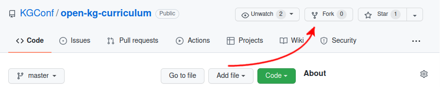

# Contribution Guidelines
Welcome to the contribution guidelines for the KGC's Open Curriculum on Knowledge Graphs! We're happy to have you; take a look down below for an overview of
* a guide of the _mechanics_ of contributing,
* what goes into contributing new content or to existing content, and
* what sort of contributions we're looking for.

## The Mechanics of Contributing
Technical Requirements for Contributing
- You need a GitHub Account
  - This is free and [quite easy to set up](https://docs.github.com/en/get-started/signing-up-for-github/signing-up-for-a-new-github-account)!

It will first help to get an idea of how contributing will work. GitHub allows us to manage something called a `git` repository, which allows us to track changes made to the contents of the repository. It is fair to think of it as a sort of "slowed down Google Docs." Essentially, changes are gatekept by a set of maintainers. Changes by the community are driven via discussion in Issues, discussions in the Slack workspace, and by making Pull Requests via the GitHub interface. In the following guide, we'll give a short tutorial on how to do this, if you're unfamiliar with git and GitHub. If you are already comfortable with this process, please skip to the end where we describe the "Contribution Process" and the corresponding expectations.

### The Process in a Nutshell
1. "Fork" the Curriculum. That means you're going to create a local copy of the curriculum that is free for you to edit.
2. Edit the Curriculum in place. 
3. Make a Pull Request, that will allow us to incorporate your changes into the Curriculum, pending discussion and review!
4. Discuss the Pull Request with the community and maintainers, as necessary!

### How do I "Fork" the repository?
* First click on the Fork Button

* details
* See Also: [Forking a Repository -- GitHub Docs](https://docs.github.com/en/get-started/quickstart/fork-a-repo)

### How do I edit the Curriculum?
* details
* details
* See Also: [Editing Files -- GitHub Docs](https://docs.github.com/en/repositories/working-with-files/managing-files/editing-files)

### How do I make a "Pull Request"?
* details
* details
* See Also: [Creating a Pull Request -- GitHub Docs](https://docs.github.com/en/pull-requests/collaborating-with-pull-requests/proposing-changes-to-your-work-with-pull-requests/creating-a-pull-request)

### How do I file an Issue?
* File an Issue [here](https://github.com/KGConf/open-kg-curriculum/issues)
* Please be as descriptive as possible
* No Trolling; be polite.
* Make sure to label it with a label!
* See Also: [Creating an Issue -- GitHub Docs](https://docs.github.com/en/issues/tracking-your-work-with-issues/creating-an-issue)

## A Guide for Contributing to Content
The first step to contributing is always to take a look at the [open issues page](https://github.com/KGConf/open-kg-curriculum/issues). New contributions can also be discussed on the [Slack Workspace]()! Also, keep in mind that contributions can, and often do, start quite small. As such, feel free to create a more open-ended issue and see where the discussion takes the feature-request.

For example, we could start with the question, "What does a Project Manager need to know about Tiger Graph?" At the time of this writing, we'd need a Project Manager audience created, a Module describing Tiger Graph, and a list of Concepts that are useful to know about a triplestore platform. Some might be new (e.g., "What is the cloud?") or might already be in our Curriculum (e.g., "Entailment Regimes").

### How do I contribute a _Learning Path_?
1. Check the open issues!
2. detail

### How do I contribute to an existing _Learning Path_?
1. Check the open issues!
2. detail

### How do I contribute new a _Module_?
1. Check the open issues!
2. detail

### How do I contribute to an existing _Module_?
1. Check the open issues!
2. detail

### How do I contribute a new _Concept_?
1. Check the open issues!
2. detail

### How do I contribute to an existing _Concept_?
1. Check the open issues!
2. detail
