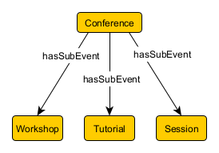

# Properties
## Details
* Category: [Standards](../../categories/Standards.md), [RDFS](../../modules/RDFS.md), [OWL](../../modules/OWL.md)
* Module Prerequisites: None 
* Audience: [Any](../../audiences/Any.md)
* Level: [Beginner](../../levels/Beginner.md)

## Content
### What are *properties* in triples or knowledge graphs? 

Triples are the fundamental data structure of the Resource Definition Framework (RDF) developed by the World Wide Web Consortium (W3C) and introduced in the Open Curriculum’s [RDF Module](../RDF/RDF.md). Triples are made up of a subject, predicate, and object. [1] 

    subject    predicate    object

The *predicate*, like a verb in natural language, expresses how the subject is *related* to the object. Here are some sample definitions of knowledge graphs. Notice how relationships (italics ours) are integral to these definitions. 

>"[Google] has been working on an intelligent model—in geek-speak, a “graph”—that understands real-world entities and their *relationships* to one another: things, not strings." [2]

>“Knowledge graphs are large networks of entities, their semantic types, *properties*, and *relationships* between entities” [3]. 

>“A knowledge graph (i) mainly describes real-world entities and their *interrelations*, organized in a graph, (ii) defines possible classes and *relations* of entities in a schema, (iii) allows for potentially *interrelating* arbitrary entities with each other, and (iv) covers various topical domains.” [4]

The RDF term for predicate is *property*. Predicate and property refer to the same concept and are often used interchangeably. [5, 6] 

### Why are properties like arrows? ### 
Like a one way street sign, the predicate states the nature of the relationship in a *directional* way, i.e., from subject to object. The subject is the point of origin and the object is the target of the arrow. Properties describe how subjects relates to objects, *not* how objects relate to subjects. 

Specifying direction enables modeling _asymmetrical_ relationships, including hierarchy, influence, dependency, and causation, which we explore in later sections. [7] 

Natural language is directional when describing asymmetrical relationships. For example, a parent-child relationship is directional. Saying (1) "Bob _is a parent of_ Jan, his daughter" is not the same as saying (2) "Jan _is a parent of_  Bob, her father." The relationship  "_is a parent of_" works one way not both ways. If the subject and object are switched, or inverted, the verb changes. Changing the verb—saying "Jan _is a child of_ Bob, her father"—makes the second sentence true.  

Sometimes, in natural language, when you invert the subject and object of a sentence, the verb changes from active to passive voice. "The speaker _presents_ the session" is active; but in passive voice, the verb becomes "The session _is presented by_ the speaker." 

To use an example from KGC, a _conference_ has related subevents, such as workshops, tutorials, and sessions. So a triple like "Conference _hasSubevent_ Workshop" would make sense. 

<p align="center" width="100%">
    
</p>

But the inverse, "Workshop _hasSubevent_ Conference" would not make sense. When you invert the subject and the object of this triple, the property "_hasSubevent_ " changes to "_isSubeventOf_" as the direction of the arrow changes. 

<p align="center" width="100%">
    
</p>

In OWL, you can formally express that two properties are the inverse of each other. In this example, the  _isSubEventOf_ is `owl:inverseOf` the _hasSubEvent_ property. 
```
kgc:isSubEventOf owl:inverseOf kgc:hasSubEvent
```

Some properties _are_ symmetrical. If Jan is a sibling of Scott, her brother; Scott is also a sibling of Jan. In symmetrical relationships, the arrow goes both ways, like a two-way street sign. Two equivalent classes are symmetrical, their Venn diagrams overlap perfectly. But, like a tautology, they don't add new information. 

### What other terms are used for properties?  ###
There are many different contributors to the knowledge graph community. Borrowing from solid geometry, properties are sometimes called *edges*. In graph theory properties are often called *arcs*. 

#### Properties can be called edges and arcs
| Methodology | Subject | Property | Object|
| --- | --- | --- | --- |
| Solid Geometry | vertex | edge | vertex|
| Graph Theory | nodes  | arcs  | nodes|

In solid geometry, a *vertex* is the meeting point of two or more edges of a solid shape. An *edge* connects two vertices (the plural of vertex), defining how they are related spatially. Like a predicate, an edge connects two elements; so, edge is often used interchangably with predicate and property.   

<p align="center" width="100%">
    
    
Graph theory uses different terms, describing networks in terms of *nodes* and *arcs*. Since graphs are directional, the subject has an *outgoing* edge (or arc), the object has an *incoming* edge. With this terminology you can decode these definitions: 

>"A graph is a collection of *vertices* interconnected by *edges*" [8]

>"An object is a *node* in a linked data graph with at least one incoming *edge*." [9] 

>"*RDF Graph*: A labeled *directed* graph, i.e., a set of nodes connected by *directed-arcs*. [9]

#### Properties are similar to roles, attributes, relations, labeled link lines, and associations 

There are many methods for modeling knowledge, e.g., approaches to description logic and knowledge graph embedding. It helps to be familiar with terms synonymous with property so you can interact with a wide group of stakeholders, understand their terms, and incorporate their insights.  

| Methodology | Subject | Property | Object|
| --- | --- | --- | --- |
| Description Logics | concept or instance | roles (object properties) or attributes (data properties) | concept or instance |
| Knowledge Graph Embedding Fact* | head (h)  | relation (r) | tail (t) |
| Graph Theory | starting point or tail | arc or directed edge | arrival point or head |
| Mind maps. Concept maps.  | nodes (boxes, circles, diamonds, etc.)  | labeled link lines, arrows | nodes |
| Topic map (for indexes) | topics| associations | occurrences |

This is a quirk you may encounter. We mentioned graph theory uses the terms "node" and "arc". Graph theory also uses "head" and "tail" to distinguish the endpoints of an arc in a directed graph, as does knowledge graph embedding (KGE). However, in graph theory the _subject_ is the tail (or starting point connected to the outgoing arc) and _object_ is the head (or rrival point connected to the incoming arc).[11] For KGE, the subject is the _head_ and the object is the _tail_. It's a flip of a coin.

#### Equivalency Relationships
Now you know various terms used for the same concept--properties. Terms like arc, edge, labelled link, relation, and association are synonymous or nearly synonymous with property and come from the many disciplines and methods that contribute to knowledge graphs: e.g., discrete math, philosophy, logic, library science. 

This discussion also illustrates _equivalency_, one of the primary relationships used in controlled in controlled vocabularies. Earlier we said knowledge graphs are directional because they model asymetrical relationships. But knowledge graphs can also model equivalent or symmetrical relationships.  symmetrical: the arrow goes both ways, like a two-way street sign. Two equivalent classes are symmetrical,

### Properties are expressed in lower camel case ### 

Properties are conventionally written in lower camel case: a naming convention joining multiple words into a single word with no spaces. Like humps on a camel, lower camel case capitalization goes up and down when you combine words: all letters of the first word are lowercase but the first letter of each subsequent word is capitalized. [12]

```rdfs:subClassOf
rdf:type
rdf:predicate 
owl:sameAs
xyz:isSubsidiaryOf
```

## Can I specify the type of subject and object that a property connects?  ##
| Methodology | Subject | Predicate | Object|
| --- | --- | --- | --- |
| RDFS and OWL | domain | object or data properties | range|

In RDF, the *domain* is the set of resources that can serve as the subject of a certain property; likewise, the *range* is the set of resources that can serve as the object of that property. What is the benefit of specifying the domain and range of a property? It adds semantic contraints by specifying the class typically associated with a property.   


## Related KGC Media
* KGC Book Club: Michael Uschold, *Demystifying OWL for the Enterprise*, Spring 2021
* KGC Book Club: Dean Allemang, *Semantic Web for the Working Ontologist*, Fall 2020


## References

[1] Allemang, Dean and James Hendler. *Semantic Web for the Working Ontologist.* p. 67

[2] Amit Singhal, Introducing the Knowledge Graph: things, not strings, (May 16, 2012) https://blog.google/products/search/introducing-knowledge-graph-things-not/

[3] Krötzsch, Markus and Gerhard Weikum. “Web Semantics: Science, Services and Agents on the World Wide Web.” Journal of Web Semantics 37–38 (March 2016): 53–54. https://doi.org/10.1016/j.websem.2016.04.002.)

[4] Paulheim, Heiko. “Knowledge Graph Refinement: A Survey of Approaches and Evaluation Methods.” Semantic Web 8, no. 3 (2017): 489–508. (https://doi.org/10.3233/SW-160218)>

[5] WC3, RDF 1.1 Primer [3.1 Triples](https://www.w3.org/TR/rdf11-primer/#:~:text=The%20subject%20and%20the%20object,elements%20they%20are%20called%20triples)

[6] Uschold, Michael. *Demystifying OWL for the Enterprise.* Morgan & Claypool, 2018. Section 2.4.3 Properties, p 45

[7] Uschold, ibid. Section 4.6.3 Symmetric and Asymmetric Properties, p 100

[8] D3 Graph Theory, Vertices and Edges (https://d3gt.com/unit.html)

[9] WC3, JSON-LD 1.1, 1.4 Terminology (https://www.w3.org/TR/json-ld11/)

[10] "Knowledge Graph Embedding", [Wikipedia](https://en.wikipedia.org/wiki/Knowledge_graph_embedding)

[11] Éric D. Taillard, section 1.2.2 Directed Graph, Arcs in ["Elements of Graphs and Complexity Theory," _Design of Heuristic Algorithms for Hard Optimization_](https://link.springer.com/chapter/10.1007/978-3-031-13714-3_1#auth-_ric_D_-Taillard) See also "Graph (discrete mathematics)", [Wikipedia](https://en.wikipedia.org/wiki/Graph_(discrete_mathematics)#Directed_graph) 

[12]  Terrell Hanna, Katie. "lowerCamelCase", https://www.techtarget.com/whatis/definition/lowerCamelCase

## Contributors
* Steve Gillespie
