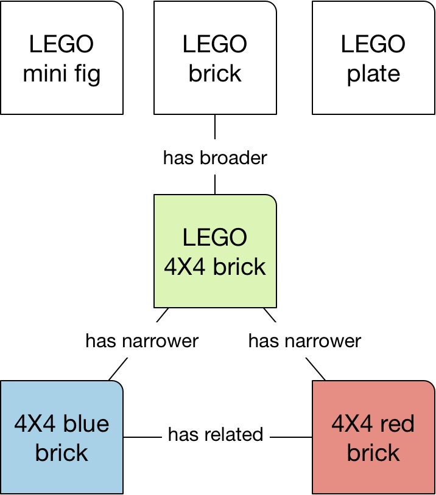
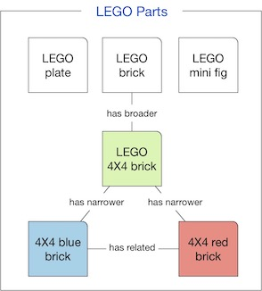

# SKOS
## Details
* Category: [Standards, Resources](../categories/Standards,_Resources.md)
* Module Prerequisites: [RDF](../modules/RDF.md)
* Audience: [Student, Developer](../audiences/Student,_Developer.md)
* Level: [Intermediate](../levels/Intermediate.md)

## About SKOS
The [**Simple Knowledge Organization System**](https://www.w3.org/2004/02/skos/) (SKOS) is a linked data standard promoted by the [World Wide Web Consortium](https://www.w3.org) (W3C). SKOS is designed to represent taxonomies and other classification systems. It offers a straightforward model for defining concepts--such as you might see in a dictionary or book index--and relating them to each other. Because of its relative simplicity, SKOS is often recommended to new practitioners learning how to develop taxonomies and ontologies using linked data.

The SKOS model is centered around a **concept**. Think about something that you might want to define and document in your own vocabulary, for example, "Sourdough bread," "Hybrid automobile," "European Union," or, in this case, a LEGO brick:


Our first concept, which we'll call LEGO_brick_4X4, represents a single type of brick, square and with four studs. But that brick doesn't exist in a vacuum. There can be millions of variations of LEGO parts; the example above is both more specific than some LEGO categories and more general than others:


In our second example, our original, generic 4X4 brick relates downward to more specific, _narrower_ versions in different colors. It also relates upward to an even more general brick concept representing all of the possible variations in brick type, including as 1X2, 4X8, etc. Notice also that the blue and red variations are identified as _related to_ each other. They have some things in common without being in the same line of succession from our original brick.

So a concept can relate to another concept in one of three primary ways:

* It can be **broader**, as in "Transportation" is a more general concept than "Automobile";
* It can be **narrower**, as in "Electric boat" represents a subset of the category "Boat";
* It can be **related** to another, similar concept that appears elsewhere in the model

But let's take it a step further. We've mentioned that at the top level of our model sits a super concept covering all LEGO bricks. It actually sits alongside other super concepts covering other broad categories of LEGO parts, including minifigures and plates. These top-level concepts are known as **Top Concepts**:



Finally, at the highest level, we wrap up our enter model in something called a **Concept Scheme**. The concept scheme defines the overall theme of the vocabulary:



As you can infer from the above examples, taxonomies tend to be designed hierarchically. The hierarchies can vary in overall design. One SKOS taxonomy could be relatively wide, with a larger number of top concepts. Another could feature a succession of "narrower than" relations going many levels deep. The purpose of the taxonomy may define its overall structure: think of an ecommerce site covering a broad portfolio of high-level categories including electronics, housewares, personal care, and toys. A different structure might have limited options at the top level but do a deep dive into subcategories.

## SKOS in Action

Now let's take a look at SKOS as it can be represented in [RDF](../../modules/RDF.md). The following example was produced using the Turtle serialization, which is one of the most compact, straightforward, and popular formats for writing RDF:

```
@prefix : <http://mylegosite.com/LEGOCat#> .
@prefix rdf: <http://www.w3.org/1999/02/22-rdf-syntax-ns#> .
@prefix skos: <http://www.w3.org/2004/02/skos/core#> .

<http://melvinmasterlego.com/brick44>
  skos:prefLabel "brick44" ;
.
:LEGOBricks
  rdf:type skos:Concept ;
  skos:definition "General-purpose interlocking square or rectangular bricks with studs on the top and holes on the bottom." ;
  skos:narrower :LEGO_brick_4X4 ;
  skos:narrower :LEGO_brick_4X8 ;
  skos:prefLabel "LEGO bricks" ;
  skos:topConceptOf :LEGOParts ;
.
:LEGOMinifigs
  rdf:type skos:Concept ;
  skos:narrower :SpacePilotMinifig ;
  skos:prefLabel "LEGO minifigs" ;
  skos:topConceptOf :LEGOParts ;
.
:LEGOParts
  rdf:type skos:ConceptScheme ;
  skos:prefLabel "LEGO parts" ;
.
:LEGOPlates
  rdf:type skos:Concept ;
  skos:prefLabel "LEGO plates" ;
  skos:topConceptOf :LEGOParts ;
.
:LEGO_brick_4X4
  rdf:type skos:Concept ;
  skos:broader :LEGOBricks ;
  skos:exactMatch <http://melvinmasterlego.com/brick44> ;
  skos:narrower :LEGO_brick_4X4_blue ;
  skos:narrower :LEGO_brick_4X4_red ;
  skos:prefLabel "LEGO brick 4X4" ;
  skos:related :LEGO_brick_4X8 ;
.
:LEGO_brick_4X4_blue
  rdf:type skos:Concept ;
  skos:broader :LEGO_brick_4X4 ;
  skos:prefLabel "LEGO brick 4X4 blue" ;
  skos:related :LEGO_brick_4X4_red ;
.
:LEGO_brick_4X4_red
  rdf:type skos:Concept ;
  skos:broader :LEGO_brick_4X4_red ;
  skos:prefLabel "LEGO brick 4X4 red" ;
  skos:related :LEGO_brick_4X4_blue ;
.
:LEGO_brick_4X8
  rdf:type skos:Concept ;
  skos:prefLabel "LEGO brick 4X8" ;
  skos:related :LEGO_brick_4X4 ;
.
:SpacePilotMinifig
  rdf:type skos:Concept ;
  skos:historyNote "This general figure type was replaced with more specific designs pertaining to individual sets starting in 1985" ;
  skos:prefLabel "Space pilot minifig" ;
  skos:scopeNote "Limited to sets with product numbers 2474 to 3488" ;
.

```
The example above points to the main vocabulary's home at a mock website (so don't go there!) and all of the concepts prefaced with ":" refer to that site, a shortcut for writing out the full text. The other two prefixes represents similar shortcuts referring to terms in the SKOS and RDF ontologies.

Notice that we have defined one concept scheme ("LEGOParts"), three top concepts ("LEGOBricks," "LEGOPlates," "LEGOMinifigs"), and multiple concepts. Also look for additional built-in SKOS properties that helps describe each concept in terms of library standards, including prefLabel, scopeNote, and historyNote.

Finally, the concept LEGO_brick_4X4 features a different kind of relationship:

``
skos:exactMatch <http://melvinmasterlego.com/brick44> ; 
``

Let's assume that the developer of this LEGO taxonomy has discovered a _different_ LEGO taxonomy at another website. The **exactMatch** relationship allows the author to make connections between similar and, for all intents and purposes, exact matches with terms at other web locations.

## The SKOS property list:

Here, cribbed from [Wikipedia](https://en.wikipedia.org/wiki/Simple_Knowledge_Organization_System), is a compact representation of the entire list of properties available in SKOS:

| Concepts	| Labels & Notation	| Documentation	| Semantic Relations | Mapping Properties | Collections |
| --------- | ----------------- | ------------- | ------------------ | ------------------ | ----------- |
| Concept	| prefLabel	| note | broader	| broadMatch	| Collection |
| ConceptScheme	| altLabel	| changeNote	| narrower	| narrowMatch	| orderedCollection |
| inScheme	| hiddenLabel	| definition	| related	| relatedMatch	| member |
| hasTopConcept	| notation	| editorialNote	 | broaderTransitive	| closeMatch	| memberList |
| topConceptOf	| | example	| narrowerTransitive	| exactMatch |	
||| historyNote	| semanticRelation	| mappingRelation	
||| scopeNote			

## Summary

As you can see, SKOS offers an easily understandable and comprehensive introduction to RDF taxonomies and ontologies. It's particularly well suited to library applications, providing ample options for describing the nature, history, scope, and relationship between terms in a vocabulary. Beginners are advised to start with the SKOS Simple Knowledge Organization System Primer at the reference link below.

## Related KGC Media
* Workshop Example
* Tutorial Example

## References
[1] [SKOS homepage at the W3C](https://www.w3.org/2004/02/skos/)

[2] [SKOS primer](https://www.w3.org/TR/2009/NOTE-skos-primer-20090818/)

[3] [SKOS on Wikipedia](https://en.wikipedia.org/wiki/Simple_Knowledge_Organization_System)

## Contributors
* Cogan Shimizu
* Glenn Clatworthy
