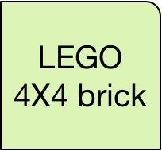
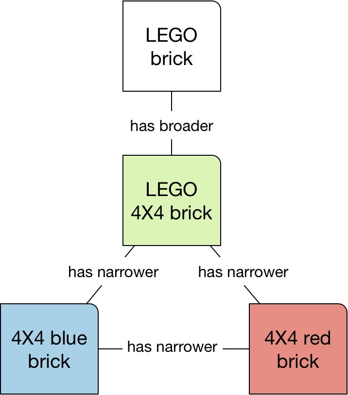

# SKOS
## Details
* Category: [Standards, Resources](../categories/Standards,_Resources.md)
* Module Prerequisites: [RDF](../modules/RDF.md)
* Audience: [Student, Developer](../audiences/Student,_Developer.md)
* Level: [Intermediate](../levels/Intermediate.md)

## About SKOS
The [**Simple Knowledge Organization System**](https://www.w3.org/2004/02/skos/) (SKOS) is a linked data standard promoted by the [World Wide Web Consortium](https://www.w3.org) (W3C) SKOS is designed to represent taxonomies and other classification systems. It offers a straightforward model for defining concepts--such as you might see in a dictionary or book index--and relating them to each other. Because of its relative simplicity, SKOS is often recommended to new practitioners learning how to develop taxonomies and ontologies using linked data.

The SKOS model is centered around a **concept**. Think about something that you might want to define and document in your own vocabulary, for example, "Sourdough bread," "Hybrid automobile," "European Union," or, in this case, a LEGO brick:

A LEGO brick, square and with four studs, doesn't exist in a vacuum. The example above is a more specific example of *all* LEGO bricks, of which there can be millions of variations. In our example, the generic 4X4 brick relates downward to more specific, _narrower_ brick types with different. colors. It also relates upward to more general kinds of bricks such as 1X2, 4X8, etc. Notice how these varieties are expressed in the next chart:

Of all the different types of LEGO bricks in the world, a 4X4 brick is a more specific, narrower example. You could take this example further:

    LEGO brick
         has narrower
    4X4 brick
         has narrower
    4X4 blue brick

Of course, LEGO bricks come in other colors than blue. 

                             LEGO brick
                           has narrower
                             4X4 brick
                         has narrower
    4X4 blue brick   has related   4X4 red brick
    
SKOS vocabularies tend to be designed hierarchically. All terms in the vocabulary fit into an overarching **concept scheme** defining its overall theme (e.g.,  "Agriculture" or "Film industry"). At the highest level of the model sit major categories known as **top concepts**. For example, a film industry vocabulary might include top concepts such as:

* Creative
* Business
* Legal
* Production

The vocabulary's designer then adds more specific concepts to each of the top concepts. "Creative," above, may contain underlying categories such as:

* Screenwriting
* Music
* Sets
* Directing

Each of the lower-level topics can expand outward with even more concepts. "Sets," above, might have two additional concepts:

* Sets
	* Set design
	* Set construction

Thus, a SKOS model expands outward in a tree structure from the concept scheme to top concepts to as many levels as needed to fully express a vocabulary. The model can be broad or deep, depending upon the number of top concepts vs. the number of nested levels of underlying concepts.

A concept can relate to another concept in one or three ways:

* It can be broader, as in "Transportation" is a more general concept than "Automobile";
* It can be narrower, as in "Electric boat" represents a subset of the category "Boat";
* It can be related to but different from a 

## Related KGC Media
* Workshop Example
* Tutorial Example

## References
[1] Reference example.

## Contributors
* Cogan Shimizu
