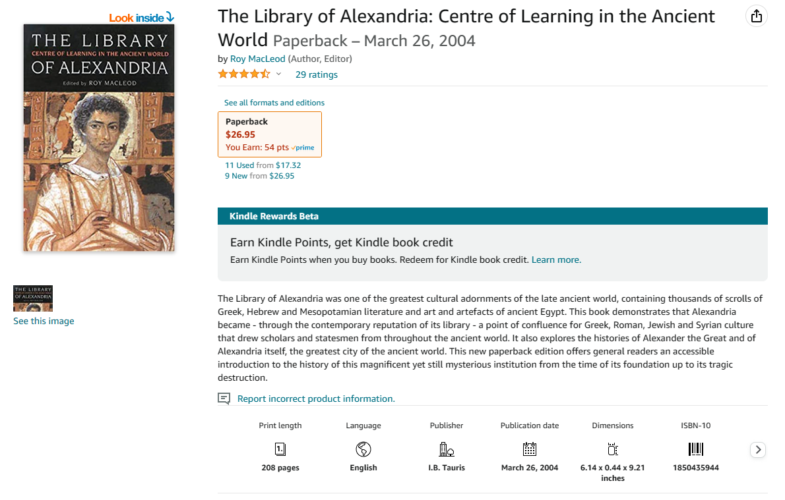
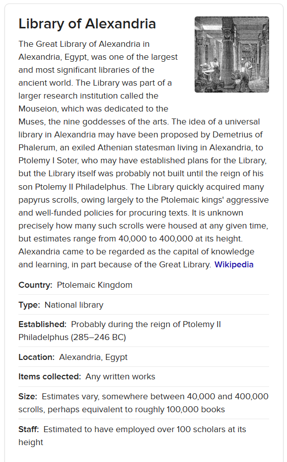
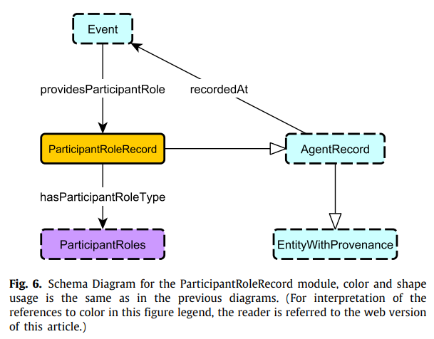

# What is Metadata
## Details
* Category: [Foundational](../categories/Foundational.md)
* Module Prerequisites: None
* Audience: [Any](../audiences/Any.md)
* Level: [Beginner](../levels/Beginner.md)

## Content

### What is Metadata?

Metadata is simply *data about data*. Just as data enables humans to organize, track, and take intelligent action on objects in the real world, metadata empowers knowledge workers to organize, track, and act intelligently on data itself.

It is sometimes claimed that the first metadata was a library catalog system—specifically, if one is looking for firsts, the catalog of the ancient Library of Alexandria. Supposedly, metadata kept at Alexandria listed Genre, title, author, and length for each book [1]. In fact, books remained one of the most important domains of metadata even at the opening of the 21st century. Amazon’s website, even from its humble beginnings when it was only a digital bookstore, used many of the same pieces of information. It added the sorts of information tracked by the library of Alexandria to to more modern administrative metadata such as ISBN. Amazon's early adoption of this metadata has been cited as a contributing factor in its success. And not only did it succeed wildly as one of the world's first digital booksellers, its practices quickly spread to brick-and-mortar stores as well as libraries. Metadata enabled stores to efficiently organize their own inventory, and for consumers to efficiently discover titles they wanted to read. [2]

  

---

_The Amazon store listing for a book about the Library of Alexandria contains a panel with the most important metadata: The book's length, language, publisher, publication data, physical size, and ISBN._ 

---

But we now know that the internet was, by that time, in the process of replacing books as humanity’s largest store of information. Enter the Semantic Web movement in the early 2000's. Espoused by digital luminaries such as Tim Berners-Lee, the Semantic Web was partly a vision for websites--already proliferating to a degree that made web search challenging--to be annotated with metadata not unlike those used by our booksellers. But it was also so much more. It is the Semantic Web which birthed the concept of the URI, or Universal Resource Indicator, a uniquely identifying string for _any_ resource, physical or digital. Imagine an ISBN, but for _anything you can imagine_. Complete adoption of these URIs would enable software to perform nearly any task, and locate any information, that human beings performed or located by surfing the web themselves. [1]

Though many individual ideas from the Semantic Web have been realized, and influenced the internet's development since, the full vision of the Semantic Web is one in which essentially all information online is made machine-readable--in a single universal language--as well as human-readable. It is a sweeping vision, one which, it is largely acknolwedged, remains unrealized. [1]

Metadata broadly falls into three categories[4].

* Descriptive metadata: metadata that provides information on data to facilitate discovery, source-verification, significance and identification such as tile, author, genre, date published etc.. 
* Structural metadata: metadata that provides information on technical specifications, structure of data such as file format, page number, file sizeetc..
* Administrative metadata: metadata used for organizatonal purposes. This can include unique identifiers, genre, keywords etc...

### What is Metadata as it Relates to Knowledge Graphs?

  

---

_A Google web search for "Library of Alexandria" brings up this panel of information sourced from Wikipedia's Wikidata. Many of the entries on this metadata, such as the library's country of origin, are in fact links to other entities in Wikidata with identifiers and metadata of their own._ 

---

Knowledge graphs are data structures, containing interlinked descriptions of concepts, entities, relationships, and events, which may be analyzed and queried like databases. (See "What are Knowledge Graphs?" for more.) Diverse pieces of data can be described and related to one another by making connections between their metadata, in what is called the knowledge model [3]. For example, the search result shown to the left provides metadata about the historical entity "The Library of Alexandria", including its country of origin, "The Ptolemaic Kingdom". But what if the searcher does not know what the Ptolomaic Kingdom is? Without connections, this piece of metadata might not be very useful. But because it is embedded in a knowlege graph, the searcher can discover what other pieces of metadata are connected to it, discovering more about what the Ptolomaic Kingdom is (in this case, by following a Wikipedia link). The developer of a knowledge graph collects and contextualizes metadata, which makes it more effective at communicating the meaning of the related data and entitites to users. A knowledge graph can be used to discover new related information, understand how information fits into a larger whole, and even highlight inconsistencies between related data that might otherwise remain disparate. 
[[Integrate or delete: This includes the relevance of the graph, highlight inconsistencies among different instances and methods/links to reuse knowledge graphs in bigger or specialized graphs.]]

  

---

_This diagram shows a portion of "The Enslaved Ontology", the ontology for the knowledge graph hosted at enslaved.org. [Describe what this particular module is stating]._ 

---

However, one man's metadata is another man's data. The metadata of, say, a published book is merely the "data" of a knowledge graph. A knowledge graph's "metadata" typically refers to the even-higher-level descriptions of that data in turn, what is often called a knowledge graph's ontology or schema [5]. This schema includes rules and patterns governing how pieces of information in the knowledge graph exist in relation to one another. If data on a published book was contained in a knowledge graph, for example, metadata for that graph might include the assertion that Book and Publisher are relevant categories of information, and that every Book has a Publisher.

[Probably add a brief note about how ontology also enables automatic reasoners/other programmatic interface with the information.]

[Placeholder]

[Placeholder]

[Placeholder]

[Placeholder]

[Placeholder]

[Placeholder]

[Placeholder]

[Placeholder]

[Placeholder]

## Related KGC Media
* Workshop Example
* Tutorial Example

## References
[1] Pomerantz, Jeffrey. *Metadata*. The MIT Press, 2015. 

[2] Dawson, Laura. "What We Talk About When We Talk About Metadata". Chapter from *A Futurist's Manifesto*. O'Reilly Media, 2012

[3] "What is a Knowledge Graph". ontotext.com. https://www.ontotext.com/knowledgehub/fundamentals/what-is-a-knowledge-graph/ (accessed Feb. 5, 2023)

[4] "Metadata and Its Importance in a Data Driven World". villanovau.com. https://www.villanovau.com/resources/bi/metadata-importance-in-data-driven-world/ (accessed Feb. 5, 2023)

[5] Shimizu, Cogan. (2023). CS7810, Metadata Representation Languages: Modular Ontology Modeling. [Wright State University campus 2/2/2023].

## External Media References
Canto. What is metadata? (and wy does it matter?). (Mar. 10, 2021). Accessed: Feb. 5, 2023. [Online Video]. Available: https://www.youtube.com/watch?v=fZWg0ClQkYQ

## Contributors
* Cogan Shimizu
* Christopher Menart
* Alexander Moore
* Jehan Fernando
